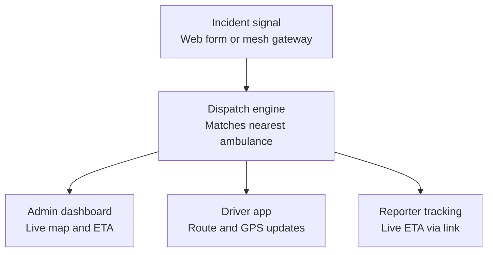

# Accident / SOS Ambulance Dispatch — Build Plan

Website, built in PyCharm (Flask), free-tier services only. As soon as an accident signal
is received, the app auto-assigns the nearest ambulance, tracks it through pickup and
hospital handoff, and keeps the reporter updated by link.

The signal-intake layer is kept generic on purpose: a plain web form for testing without
hardware, plus an API endpoint any mesh gateway (e.g. a LoRa SOS network) could POST to
later without touching anything downstream.

## System architecture

## Tech stack (free tier only)

| Layer | Pick | Why |
|---|---|---|
| Backend | Flask (Python) | Runs in PyCharm; same stack as SolVaLai |
| Database | Supabase (Postgres) free tier | 500MB free; PostGIS available for "nearest ambulance" geo-queries; free auth and realtime for later |
| Maps | Leaflet.js + OpenStreetMap tiles | No API key, no billing, no usage cap at this scale |
| Routing / ETA | OSRM public demo server to start; OpenRouteService (free key, 2,000 req/day) once reliability matters | Both free; OSRM needs no signup, ORS is sturdier |
| Live location | Browser Geolocation API on the driver's phone, pushed every 5-10s; admin/tracking pages poll | No extra infrastructure now; upgrade path to Flask-SocketIO or Supabase Realtime later |
| Auth | Flask-Login | Free, self-contained |
| Hosting — static/public pages | Netlify free tier | Fast global CDN, git-based deploys — a good fit for the landing page and the public tracking page, which are read-only and call the API from the browser |
| Hosting — backend/API | Render.com free web service | Keeps the login-protected dashboards and continuous GPS polling on a real Python process; full outbound internet access too, unlike PythonAnywhere's free tier, which blocks most outbound API calls and would break the maps/SMS integrations |
| Frontend | Jinja2 templates + Tailwind CSS (CDN) + GSAP | Matches the glass/GSAP direction planned for SolVaLai's redesign |
| Version control / deploy | GitHub (free) + Render git-push deploy | Free CI/CD |

**Hosting reality check:** Netlify's core strength is static/JAMstack sites — it doesn't run
a persistent Flask process the way Render does. The admin dashboard, driver app, and
`/api/signal` all need real login sessions and continuous polling, which don't fit Netlify's
serverless-function model well (10-second execution limit on the free tier, no persistent
server state). The split above keeps those on Render and puts only the read-only landing and
tracking pages on Netlify's CDN, calling the Render API via `fetch()` with CORS enabled. If
the whole backend needs to live on Netlify specifically, it's possible by wrapping Flask as
one serverless function with the `serverless-wsgi` package, but that trades Render's
straightforward deploys for the function timeout and cold starts.

**Notifications reality check:** there's no SMS gateway that's genuinely free at real scale.
Fast2SMS's free trial credits are enough for testing/demo. For anything longer-lived,
WhatsApp Cloud API (Meta) is free forever for the first 1,000 conversations/month and can
deliver the same tracking link — worth treating as the production path instead of chasing
free SMS.

## Pages

| Page | Route | Who sees it | What it does |
|---|---|---|---|
| Landing | `/` | Public | Intro + "report emergency" button for testing without hardware |
| Report intake | `/report`, `/api/signal` | Public / mesh gateway | Captures location, severity, contact number; creates the incident and triggers auto-assign |
| Admin login | `/admin/login` | Admin | Standard login |
| Admin dashboard | `/admin/dashboard` | Admin | Live map of incidents + moving ambulance markers with vehicle numbers; hover a route for ETA |
| Ambulance management | `/admin/ambulances` | Admin | Add/edit ambulances, assign drivers, set base location |
| Hospital management | `/admin/hospitals` | Admin | Add/edit hospitals: govt/private, location, severity-handling tags |
| Incident detail | `/admin/incidents/<id>` | Admin | Full timeline: reported → assigned → en route → hospital → closed |
| Driver login | `/driver/login` | Driver | Standard login |
| Driver dashboard | `/driver/dashboard` | Driver | Current assignment, route to the spot, "mark reached" button, sends live GPS |
| Hospital route | `/driver/hospital-route` | Driver | Appears after "mark reached"; shows auto-assigned hospital + route, "mark completed" |
| Public tracking | `/track/<token>` | Reporter (via link, no login) | Live ambulance location + ETA on a map, auto-refreshing |

## Data model

**Incident** — id, lat, lng, severity, status (reported / assigned / en_route / reached /
hospital_redirect / completed), reporter_contact, tracking_token (unique, used in
`/track/<token>`), ambulance_id (FK, nullable), hospital_id (FK, nullable), created_at,
updated_at

**Ambulance** — id, vehicle_number, driver_id (FK), current_lat, current_lng, status
(available / busy), base_lat, base_lng

**Driver** — id, name, phone, username, password_hash, ambulance_id (FK)

**Hospital** — id, name, type (govt / private), lat, lng, severity_capabilities (tags —
e.g. trauma, general, icu), available_beds (optional)

**Admin** — id, username, password_hash

## Build order

1. **Project setup** — Flask skeleton in PyCharm, GitHub repo, Supabase project, a Render
   account for the backend, and a Netlify account for the static pages. Get a bare "hello
   world" Flask app live on Render and a placeholder page live on Netlify before adding real
   logic, to confirm both deploy pipelines work.
2. **Data layer** — Define Incident, Ambulance, Driver, Hospital, Admin models with
   SQLAlchemy against Supabase Postgres. Run migrations, seed test ambulances and hospitals.
3. **Signal intake and auto-assign** — Build `/report` and `/api/signal`, both feeding the
   same incident-creation logic. Write nearest-ambulance matching (Haversine, or PostGIS if
   enabled). Test with sample incidents.
4. **Admin dashboard** — Leaflet map with incident and ambulance markers, incident list
   panel, hover-for-ETA via the routing API. Start with simple polling refresh, no
   websockets yet.
5. **Driver flow** — Driver login, assignment view with route-to-spot, "mark reached"
   button, background script pushing live GPS via the Geolocation API.
6. **Hospital auto-routing** — On "mark reached," match against the severity-tagged
   hospital table, show the route to that hospital, add "mark completed" to close the
   incident.
7. **Reporter tracking and notifications** — Token-based `/track/<token>` page; wire up
   Fast2SMS (testing) or WhatsApp Cloud API (longer-lived) to send the link and periodic
   updates.
8. **UI polish, security, and deploy** — Apply the design-token theme and GSAP touches,
   lock down admin/driver routes, move secrets into environment variables, deploy the static
   pages to Netlify and the backend to Render, and run a full end-to-end test across both.

## Keeping the UI/UX changeable and upgradable

- One root stylesheet with CSS custom properties for colors and spacing — a light/dark
  theme swap is a token-value change, not a rewrite of every page.
- A single Jinja2 base template every page extends, so nav/footer/theme changes propagate
  everywhere at once.
- Reusable partials/macros for repeated pieces (an incident card, an ambulance card) so a
  later visual redesign — like the glassmorphism/GSAP pass planned for SolVaLai — touches a
  handful of shared files instead of every route.
- Modular JS per page (`map.js`, `dashboard.js`, `tracking.js`) rather than one large
  script, so a page's behavior can change independently of the others.
